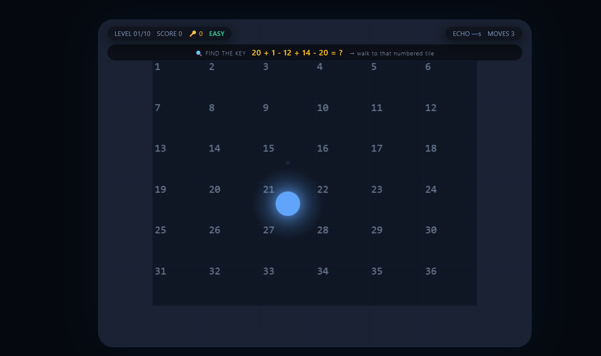
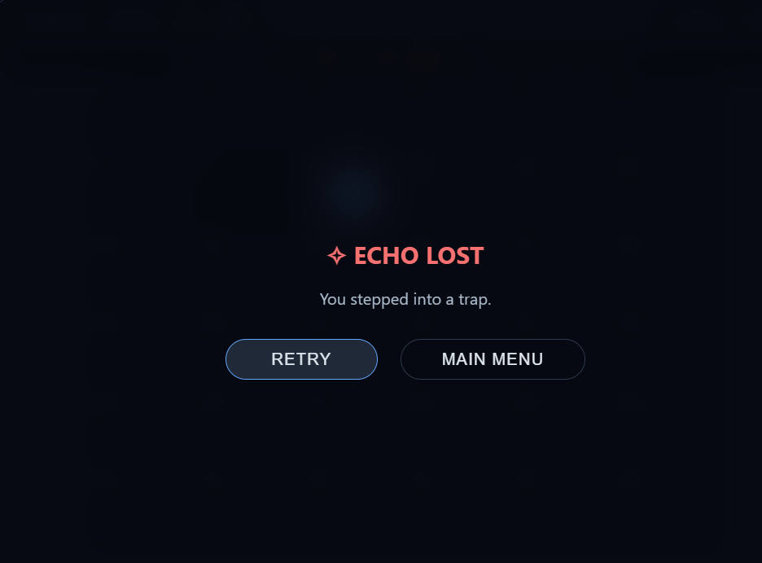
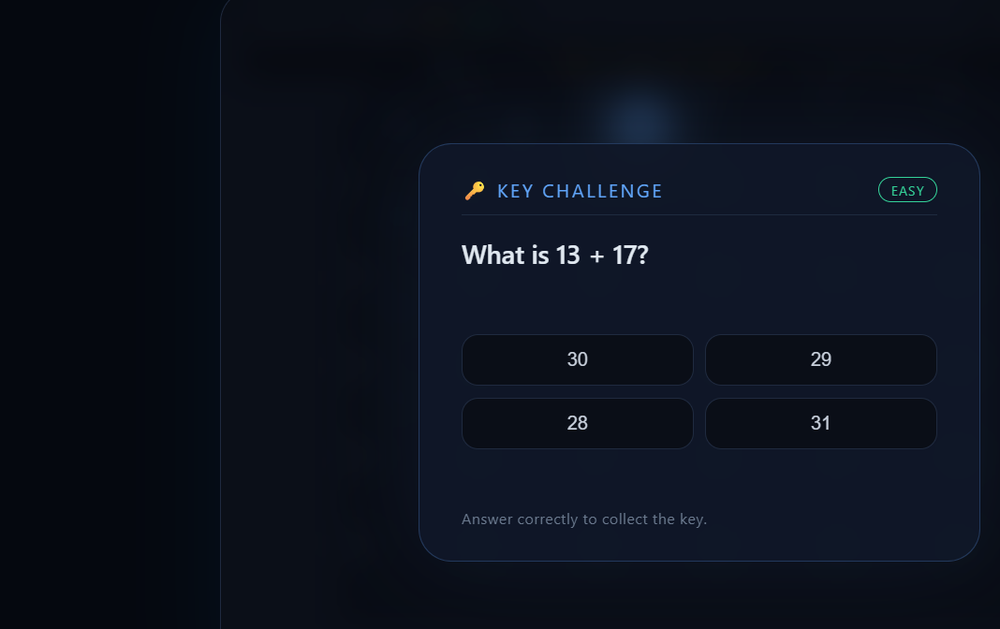
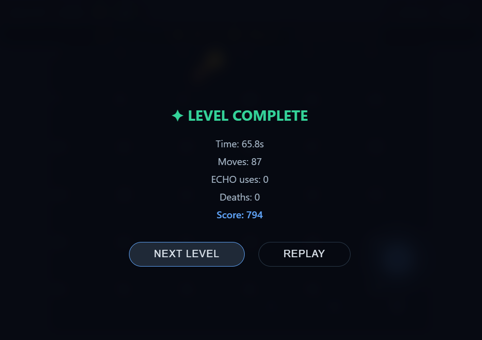

# 🧠 MNEMOS: Echo Trials

> **Remember what you cannot see.**

## 🎮 Play Now

**[▶️ PLAY MNEMOS](https://arjunrokamagar621-dot.github.io/mnemos-echo-trails/)**

## 📖 About

MNEMOS: Echo Trials is an original memory-based puzzle game...

## ✨ Features

- 🧠 Memory-based puzzle gameplay
- 🔊 Temporary ECHO vision
- 🗺️ 10 progressive levels
- 🎯 False leads and decoys
- 🔑 Key and door challenges
- 📚 Educational puzzle challenges
- ⭐ Score and performance tracking
- 📊 Echo Profile

## 🕹️ Controls

| Key | Action |
|---|---|
| W A S D | Move |
| Arrow Keys | Move |
| SPACE | Activate ECHO |
| ESC | Pause |

## 📸 Screenshots

### Gameplay

### ECHO Lost

### Key Challenge

### Level Complete

## 🛠️ Technology Stack

- HTML5
- CSS3
- JavaScript
- HTML5 Canvas
- Local Storage

## 🤖 AI Disclosure

AI tools were used for ideation, coding assistance,
debugging, and documentation.

## 🏆 Hackathon

Created for **Puzzle Masters Hackathon 2026**.
